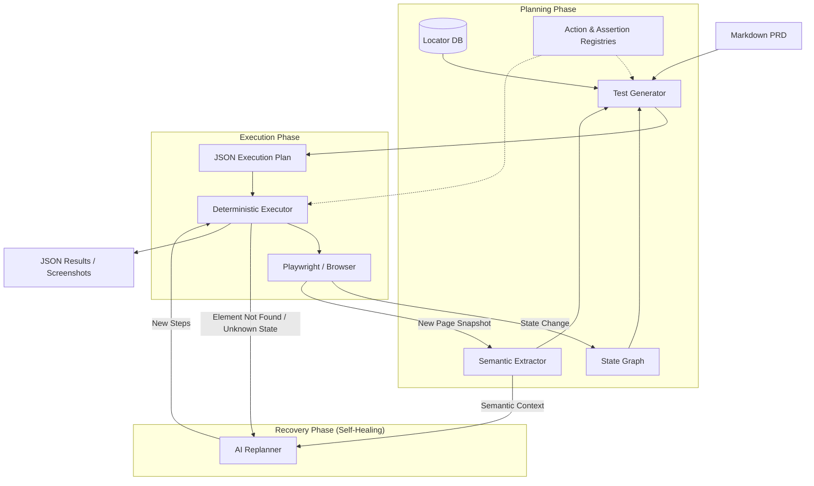

# QAPAL Project Structure & Architecture

## 1. Directory Structure

```text
QAPAL/
├── main.py                 # Unified CLI entry point (crawl, plan, run, prd-run, graph)
├── crawler.py              # Page crawler (extracts locators & spidering)
├── generator.py            # AI Test Generator (PRD -> JSON Plans)
├── executor.py             # Deterministic Executor (JSON Plans -> Playwright actions)
├── planner.py              # Test Planner (Lower-level plan creation logic)
├── replanner.py            # Recovery logic for unknown states (Self-healing)
├── semantic_extractor.py   # Page understanding (Crawl4AI / A11y tree)
├── state_graph.py          # Navigation mapper (builds URL transition graph)
├── actions.py              # Action Registry (Contract for UI interactions)
├── assertions.py           # Assertion Registry (Contract for state verification)
├── locator_db.py           # TinyDB wrapper (Stores locators, states, and graph)
├── ai_client.py            # AI Provider wrapper (OpenAI/Anthropic)
├── locators.json           # Central database (persistent state)
├── plans/                  # Generated test execution plans (JSON)
├── reports/                # Execution reports & screenshots
└── docs/                   # PRDs and specifications
```

## 2. Working Diagram (Data Flow)



## 3. Component Breakdown

### 3.1 Planning Layer
*   **TestGenerator**: The brain of the system. Reads the PRD, pulls active locators from the DB, fetches navigation paths from the `StateGraph`, and uses the `SemanticExtractor` to understand page structures. It makes a single AI call to produce multiple deterministic test plans.
*   **Planner**: Handles the mapping of high-level test cases to specific locators stored in the DB.

### 3.2 Execution Layer
*   **Executor**: A strict Playwright-based runner. It follows the plan exactly. It uses the `Action Registry` to perform clicks/inputs and the `Assertion Registry` to verify outcomes. If it encounters a URL change not in the plan, it records it in the `StateGraph`.

### 3.3 Application Understanding Layer
*   **State Graph**: Learns the "map" of the application by observing transitions. It provides the AI with real-world routes (e.g., "to get to /settings, first click /profile").
*   **Semantic Extractor**: Uses Crawl4AI or Accessibility Trees to "describe" a page to the AI in terms of roles (buttons, forms, links) rather than raw HTML.

### 3.4 Self-Healing Layer
*   **Replanner**: Triggered only when a test breaks. It takes the current page's semantic context and the remaining steps, asking the AI for a "patch" to recover and reach the goal.

### 3.5 Contract Layer
*   **actions.py**: Defines every supported UI interaction (click, fill, select). It acts as a single source of truth for both the AI (via prompts) and the Executor (via implementation).
*   **assertions.py**: Defines all verification types (url_contains, element_visible). Ensures that the AI-generated checks are valid and executable by the driver.
